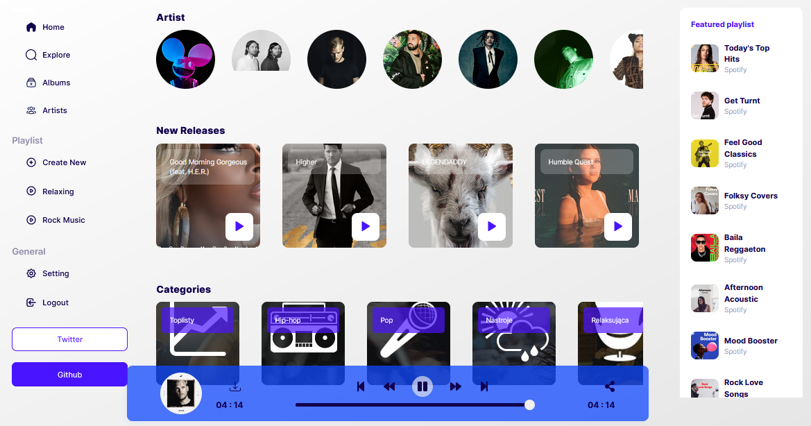

# Tunifi music player UI



#### Figma design can be found here

[figma design](<https://www.figma.com/file/oIIIcuS9LZrSXBDwm0WmU7/Music-Dashboard--Tunifi-(Community)?node-id=0%3A1>)

## Description:

simple music player frontend connected to the spotify api. The goal was to nicely present exposed spotify api endpoints and organize the data on an organized frontend. For the project, React js was used because of ease of state management with the library and also composing interfaces that are reusable and agile.
Some of the challenges while developing included unavailable data from the various endpoints from the spotify api docs.

---

## Installation and running the project

- ### Installation

  ```bash
    clone the project
    -----------------------------
    git clone https://github.com/ryanmwakio/tunifi.git
  ```

  then navigate into the project

  ```bash
    cd tunifi
  ```

  install all node dependencies

  ```bash
  npm install
  ```

  create a .env file in the root of your project

  ```bash
  touch .env
  ```

  navigate into the .env and store the client ID and client secret both required for authorization of requests [https://developer.spotify.com/](https://developer.spotify.com/) more details for getting the id and secret on the spotify api docs.

  ```bash
  REACT_APP_CLIENT_ID = your id
  REACT_APP_CLIENT_SECRET = your secret
  ```

  start the project

  ```bash
  npm start
  ```

## Credits

1. [Ryan Mwakio](https://ryanmwakio.netlify.app)

## Licence

MIT

## How to contribute to the project

contact [ryanmwakio6@gmail.com](ryanmwakio6@gmail.com)
you can extend functionality on the various navigation components on the left.
